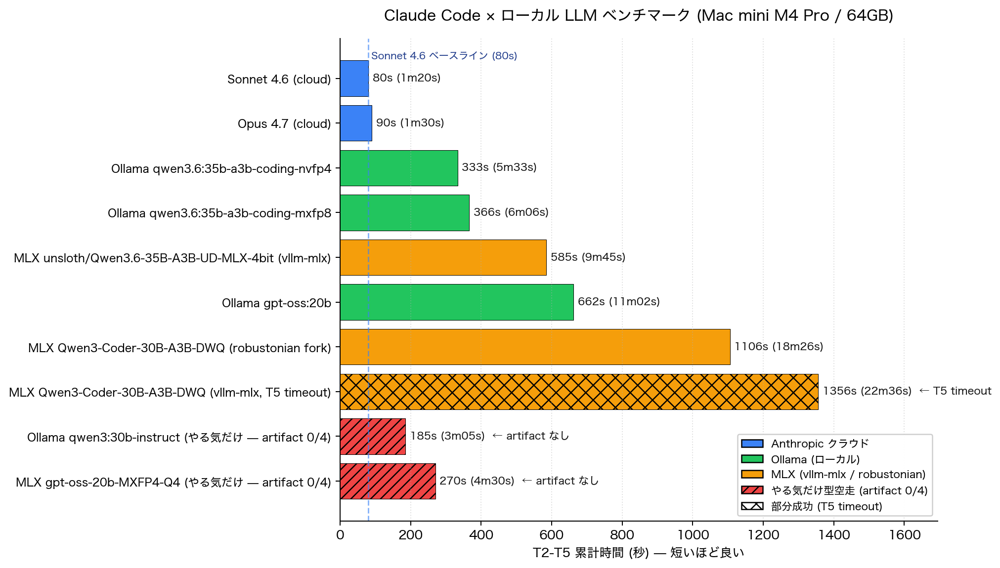
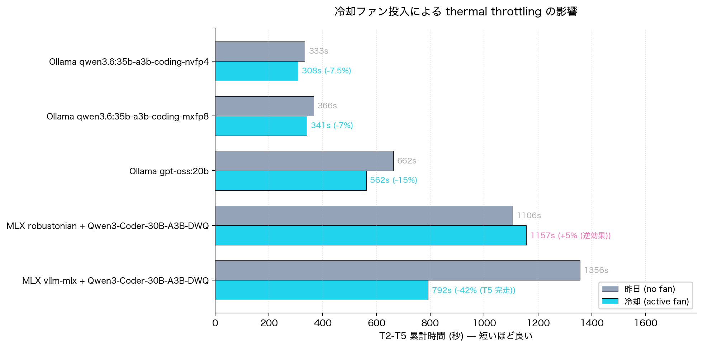

# 詳細データ・推奨モデル・運用 Tips

[← Home に戻る](./){: .btn .btn-outline }

---

## 統合サマリー (T2-T5 累計)



> 図: T2-T5 累計時間 (秒) を横軸、モデルを縦軸に並べた横棒グラフ。
> 青 = Anthropic クラウド / 緑 = Ollama / オレンジ = MLX / 赤の斜線 = artifact 0/4 の「やる気だけ型空走」。
> 青の破線が Sonnet 4.6 ベースライン (80s)。

| バックエンド | モデル | サイズ | 累計 | Tool 発火 | 全クリア | 備考 |
|---|---|---|---|---|---|---|
| Anthropic クラウド | **Claude Sonnet 4.6** *(参考)* | (API) | **1m20s** | ✅ | ✅✅✅✅ | ⭐ 速度上限の参考値 |
| Anthropic クラウド | **Claude Opus 4.7** *(参考)* | (API) | **1m30s** | ✅ | ✅✅✅✅ | ⭐ 速度上限の参考値 |
| Ollama | **qwen3.6:35b-a3b-coding-nvfp4** | 21GB | **5m33s** | ✅ | ✅✅✅✅ | ⭐ ローカル総合本命 |
| Ollama | qwen3.6:35b-a3b-coding-mxfp8 | 37GB | 6m06s | ✅ | ✅✅✅✅ | nvfp4 比 +10% で精度上振れ |
| Ollama | gpt-oss:20b | 13GB | 11m02s | ✅ | ✅✅✅✅ | 安定動作・軽量機向け |
| Ollama | qwen3:30b-instruct | 18GB | (3m05s) | ❌ | 0/4 | **「やる気だけ」型空走** |
| MLX (vllm-mlx) | **unsloth/Qwen3.6-35B-A3B-UD-MLX-4bit** | 20GB | 9m45s | ✅ | ✅✅✅✅ | ⭐ MLX 第一候補 |
| MLX (vllm-mlx) | mlx-community/Qwen3-Coder-30B-A3B-Instruct-4bit-DWQ | 16GB | 22m36s | ✅ | △ T5 タイムアウト | Ollama では XML 漏れで失敗 |
| MLX (robustonian) | mlx-community/Qwen3-Coder-30B-A3B-Instruct-4bit-DWQ | 16GB | **18m26s** | ✅ | ✅✅✅✅ | vllm-mlx 比 18% 速い |
| MLX (vllm-mlx) | mlx-community/gpt-oss-20b-MXFP4-Q4 | 10GB | (4m30s) | ❌ | 0/4 | **harmony parser 不全による空走** |
| MLX (vllm-mlx) | unsloth/Qwen3.6-27B-MLX-8bit | 30GB | DNF | (T2 のみ ✅) | ❌ | dense 8bit はメモリ帯域飽和で対話実用外 |

カッコ付きの累計は「`ls` で artifact が確認できない」/「タスク完了せず短時間で idle に戻った」見せかけの数字。**速度ランキングだけで判断してはいけない**。

### ローカル vs クラウドの速度比

| ベース | 累計 | Sonnet 4.6 比 |
|---|---|---|
| Sonnet 4.6 (クラウド) | 80s | 1.00x |
| Opus 4.7 (クラウド) | 90s | 1.13x |
| Ollama nvfp4 (ローカル最良) | 333s | **4.2x 遅い** |
| MLX UD-4bit (MLX 最良) | 585s | **7.3x 遅い** |
| Ollama gpt-oss:20b | 662s | 8.3x |
| MLX robustonian fork | 1106s | 13.8x |

---

## 用途別の推奨

| ユースケース | 推奨 |
|---|---|
| Claude Code をローカル LLM で本気運用 (一番楽) | **Ollama + qwen3.6:35b-a3b-coding-nvfp4** |
| VRAM 余裕 + 精度上振れ狙い (Ollama) | qwen3.6:35b-a3b-coding-mxfp8 (37GB) |
| RAM 16GB クラス / 並行作業優先 | Ollama + gpt-oss:20b |
| MLX を主軸に運用したい (qwen3.6 系) | **vllm-mlx + unsloth/Qwen3.6-35B-A3B-UD-MLX-4bit** |
| MLX で qwen3-coder 系を活かしたい | **robustonian/mlx-lm fork (mlx 0.30.6) + Qwen3-Coder-30B-A3B-Instruct-4bit-DWQ** (vllm-mlx 比 18% 速い、T5 完走) |
| gpt-oss 系を tool 込みで動かす | **Ollama 一択** (MLX 系はどちらも tool 互換が壊れている) |
| 速さに釣られると事故るので避ける | qwen3:30b-instruct (Ollama) / gpt-oss-20b-MXFP4-Q4・Q8 (MLX) |
| 旧世代地雷 (Claude Code 連携時) | qwen3-coder:30b (Ollama)・qwen2.5-coder:14b/32b (Ollama) — tool フォーマット漏れで全失敗 |

---

## クイックスタート

### Ollama 版 (一番楽)

```bash
# 1. モデル取得
ollama pull qwen3.6:35b-a3b-coding-nvfp4

# 2. Claude Code を Ollama に向ける (環境変数 3 つだけ)
export ANTHROPIC_AUTH_TOKEN=ollama   # 文字列 "ollama" で OK、認証なし
export ANTHROPIC_API_KEY=""
export ANTHROPIC_BASE_URL=http://localhost:11434

claude --model qwen3.6:35b-a3b-coding-nvfp4 --permission-mode bypassPermissions
```

`claude-code-router` などのプロキシは不要。Ollama 0.14+ に Anthropic Messages API 互換が組み込まれている。

### MLX 版 (vllm-mlx)

```bash
# 1. vllm-mlx 導入 + モデル取得 (HF からの自動 pull)
uv tool install vllm-mlx

# 2. サーバ起動 (tool パーサ自動判定の wrapper を同梱)
./mlx/scripts/start_server.sh unsloth/Qwen3.6-35B-A3B-UD-MLX-4bit 8000

# 3. 別シェルで Claude Code を MLX に向ける
./mlx/scripts/local_claude.sh unsloth/Qwen3.6-35B-A3B-UD-MLX-4bit 8000
```

スクリプト本体: [mlx/scripts/](https://github.com/j3tm0t0/local-llm-macmini/tree/main/mlx/scripts)

### MLX 版 (robustonian fork、Qwen3-Coder 系最速)

```bash
# qwen3_5_moe (Qwen3.6) アーキテクチャは未対応。Qwen3-Coder 系のみ対応
uv venv --python 3.12 robustonian-env && cd robustonian-env
uv pip install "git+https://github.com/robustonian/mlx-lm.git@feature/anthropic-compat-api"
# !!! upstream MLX 0.31.x のスレッドバグ回避で 0.30.6 に固定
uv pip install "mlx==0.30.*" "mlx-metal==0.30.*"

.venv/bin/python -m mlx_lm server \
  --model mlx-community/Qwen3-Coder-30B-A3B-Instruct-4bit-DWQ \
  --host 127.0.0.1 --port 8080 --max-tokens 32000
```

---

## 共通エイリアス (~/.zshrc 用)

```bash
local-claude() {
  export ANTHROPIC_AUTH_TOKEN=ollama
  export ANTHROPIC_API_KEY=""
  export ANTHROPIC_BASE_URL=http://localhost:11434
  claude --model "${1:-qwen3.6:35b-a3b-coding-nvfp4}" \
         --permission-mode bypassPermissions "${@:2}"
}
```

`local-claude` で本命起動、`local-claude gpt-oss:20b` で軽量切替。

### モデル切替時の GPU メモリ即時解放 (Ollama)

```bash
curl -s -X POST http://localhost:11434/api/generate \
  -d '{"model":"qwen3.6:35b-a3b-coding-nvfp4","keep_alive":0}'
```

### コンテキスト拡張 (Ollama / macOS App)

```bash
launchctl setenv OLLAMA_CONTEXT_LENGTH 131072
# 再起動後反映。Claude Code は履歴がすぐ太るので 128K は欲しい
```

---

## 検証で得た 4 つの教訓

1. **Ollama 0.22.1+ は Anthropic Messages API ネイティブ互換**。プロキシ不要、環境変数 3 つで Claude Code 直結。
2. **Tool 互換性は「モデル単体」では決まらない**。同じ `Qwen3-Coder-30B-A3B-Instruct-4bit-DWQ` でも、Ollama なら XML 生テキスト漏れで全失敗、MLX (vllm-mlx の `qwen3_coder` パーサ経由) なら正常発火する。逆に gpt-oss:20b は Ollama では完璧、MLX では完全空走。**サーバ × モデル × 量子化フォーマット × parser 実装の組み合わせ全部に依存する**。
3. **「やる気だけモデル」は最も危険な失敗モード**。XML / JSON が画面に漏れる従来型不一致は一目で気付くが、`Let me read the file...` と宣言した直後 idle に戻り、自然文だけ綺麗に出力するパターンは **ベンチ数字上は最速に見える**。Ollama の `qwen3:30b-instruct` と MLX の `gpt-oss-20b-MXFP4-Q4` で発生。**ログ末尾の "Cooked for X" は仕事した保証にはならない。`ls` で artifact を必ず確認**。
4. **連続生成時のサーマルスロットリング**: M4 Pro は GPU が 10 秒で 92°C に達してスロットリング入りする。比較ベンチを取るなら **テスト間に 30〜60 秒のクールダウン**を挟むこと。**外付けファンの後付けでさらに改善する** — 詳細は次セクション。

---

## 冷却ファン投入で thermal throttling を抑えるとどうなる？

検証当日 GPU が 92-95°C に張り付いていたので、Mac mini M4 Pro に外付けの静音ファンを **横から当てて** (※ 当初は背面に置いて吸い込みを補助しようとしたが、最終的には側面から直接風を当てるほうが効果的だった) active cooling を効かせ、同じ T2-T5 を再走行した。



> 図: グレー = ファンなし (昨日)、シアン = active fan (今日)。バー右の数字は累計秒と delta。

| 構成 | 昨日 | 冷却 | delta | 備考 |
|---|---|---|---|---|
| Ollama qwen3.6:35b-a3b-coding-nvfp4 | 5m33s | **5m08s** | -7.5% | 軽いモデルなので余地小 |
| Ollama qwen3.6:35b-a3b-coding-mxfp8 | 6m06s | 5m41s | -7% | 同上 |
| Ollama gpt-oss:20b | 11m02s | **9m22s** | **-15%** | T4 単独で -30%、長尺で thermal 顕著解消 |
| **MLX vllm-mlx + Qwen3-Coder-30B-A3B-DWQ** | **22m36s (T5 失敗)** | **13m12s (全完走)** | **-42%** | 昨日タイムアウトしてた T5 verbose loop が消滅 |
| MLX robustonian fork + Qwen3-Coder-30B-A3B-DWQ | 18m26s | 19m17s | **+5% (逆効果)** | VRAM が 16→38GB と肥大化、メモリ圧勝ち |

### 観察

- **温度の挙動**: ファン投入で idle 49°C (ファンなし 84°C)、生成立ち上がり 73°C (5 秒で 92°C 直行 → 70°C 帯維持) と明確に改善。ただし **連続生成中の peak は 95-99°C のまま**で天井は変わらない。「立ち上がりを遅らせる」効果はあるが「最大温度を下げる」効果はない (M4 Pro の thermal envelope の物理上限)。
- **vllm-mlx の T5 verbose loop が消えた**: 昨日 `wc_tool.py` 作成後にシステム `wc` との byte-level 比較ループに入って 10 分タイムアウトしていたタスクが、冷却下では 237s でクリーンに完走。**温度というよりも「冷えた状態だと違う decoding path を踏む」サンプリングノイズ要因**の可能性 (再現性は要追検証)。
- **gpt-oss:20b が一番恩恵**: 重め長尺タスクの T4 で -30%、累計 -15%。古典的な thermal throttling 解消パターン。
- **robustonian fork は VRAM 肥大化で逆効果**: メモリリーク疑い。冷却よりこちらが先に解決すべき問題。
- **短い T2 で +15% の謎**: 同モデルで複数観測 (nvfp4 +17%, mxfp8 +15%)。「冷えた状態の最初のリクエストは KV cache が空で pre-load ペナルティを食う」副作用と推定。**cooldown 入れすぎは逆効果**。

### 結論

| 状況 | 冷却ファン投入の効果 |
|---|---|
| 重い MLX モデルで verbose loop に詰まる | **大** (vllm-mlx Qwen3-Coder で -42% + T5 完走) |
| Ollama gpt-oss みたいな長尺タスク | -15%、効果あり |
| Ollama qwen3.6 系 (元々速い) | -7%、誤差レベル |
| メモリリーク疑いの構成 | 効果なし、別問題 (robustonian fork) |
| 単発の短いタスク | +15% で逆効果 (cooldown 入れすぎ問題) |

**Mac mini M4 Pro でローカル LLM を回すなら、横から静音ファンを 1 台当てるのは強くおすすめ**。特に MLX 系の重いモデル / 長尺タスクで詰まるケースは劇的に改善する場合がある (構成依存)。Apple 純正の冷却機構は LLM 連続生成を想定していない。

> **置き方メモ**: 最初は背面の排気口側に置いて吸い込みを助けようとしたが、Mac mini M4 Pro は底面吸気・背面排気で空気の通り道が短いので、**側面から本体外殻に風を当てて筐体ヒートシンクごと冷やすほうが体感温度が下がった**。USB 給電の小型サーキュレーターを側面 10cm 程度離して当てるくらいで十分。

---

## クラウド版 (Opus 4.7 / Sonnet 4.6) の詳細

ローカル LLM の速度感を「現実的なベースライン」と比較するため、**同一テストスイート T2-T5・同一マシン (Mac mini M4 Pro)・同一 tmux send-keys 駆動**で Anthropic クラウド版を計測した。

### 計測条件

- ペイン: 検証セッションの直下に `tmux split-window -v` で作成
- 環境変数: `ANTHROPIC_BASE_URL` / `ANTHROPIC_AUTH_TOKEN` / `ANTHROPIC_API_KEY` をすべて unset → Claude Max の標準認証
- 起動: `claude --model claude-opus-4-7 --permission-mode bypassPermissions` / `claude --model claude-sonnet-4-6 --permission-mode bypassPermissions`
- Runner: `mlx/tests/run_practical.sh` をそのまま流用 (cooldown は API なので 5s に短縮)
- ログ: [reference/results/](https://github.com/j3tm0t0/local-llm-macmini/tree/main/reference/results) 配下に保管

### タスク別タイミング

| タスク | Opus 4.7 | Sonnet 4.6 |
|---|---|---|
| T2 バグ修正 (`factorial(0)` を `1` に修正) | 16s (Sautéed for 13s) | 16s (Cooked for 14s) |
| T3 マルチファイル package (`calc/` + test) | 27s (Churned for 20s) | 21s (Crunched for 18s) |
| T4 リファクタ (3 関数の重複除去 + 動作確認) | 26s (Sautéed for 24s) | 27s (Cogitated for 21s) |
| T5 CLI + エラーハンドリング (`wc_tool.py`) | 21s (Churned for 16s) | 16s (Cooked for 13s) |
| **累計** | **1m30s (90s)** | **1m20s (80s)** |
| 全 artifact 検証 | ✅ | ✅ |

### 観察

- **Opus 4.7 と Sonnet 4.6 は今回の T2-T5 では誤差レベルの差**。Sonnet がわずかに速いのは生成トークンが軽快なため。これくらいの粒度の素直なコーディングタスクでは差が出にくい。
- **クラウド版は「やる気だけ問題」を起こさない**。tool block を確実に発火し、artifact が決定論的に作られる。ローカル LLM 検証で発見した `qwen3:30b-instruct` / `gpt-oss-20b-MXFP4-Q4` 系の空走は Anthropic クラウドでは観測されず、これは商用モデルの基本品質として期待できる。

### 再現方法

```bash
# 1. ベンチ用ディレクトリ
mkdir -p ~/tmp/cc-reference-bench/{tests,scripts,results}
cp mlx/tests/run_practical.sh        ~/tmp/cc-reference-bench/tests/
cp mlx/scripts/reset_fixtures.sh     ~/tmp/cc-reference-bench/scripts/
~/tmp/cc-reference-bench/scripts/reset_fixtures.sh

# 2. tmux で下に pane を作って Claude Code (Anthropic 認証) 起動
tmux split-window -v -c ~/tmp/cc-reference-bench
# 新 pane で:
unset ANTHROPIC_BASE_URL ANTHROPIC_AUTH_TOKEN ANTHROPIC_API_KEY
claude --model claude-opus-4-7 --permission-mode bypassPermissions

# 3. 元 pane から runner を起動 (PANE は新 pane の番号)
cd ~/tmp/cc-reference-bench
COOLDOWN=5 ./tests/run_practical.sh claude-opus-4-7 0:4.1

# 4. Sonnet も同様に
~/tmp/cc-reference-bench/scripts/reset_fixtures.sh
# 新 pane で `/quit` → claude --model claude-sonnet-4-6 --permission-mode bypassPermissions
COOLDOWN=5 ./tests/run_practical.sh claude-sonnet-4-6 0:4.1
```

### 計測ログ (raw)

| ファイル | 内容 |
|---|---|
| [`runner_claude-opus-4-7.log`](https://github.com/j3tm0t0/local-llm-macmini/blob/main/reference/results/runner_claude-opus-4-7.log) | Opus 4.7 のタイミングサマリ (1.4 KB) |
| [`runner_claude-sonnet-4-6.log`](https://github.com/j3tm0t0/local-llm-macmini/blob/main/reference/results/runner_claude-sonnet-4-6.log) | Sonnet 4.6 のタイミングサマリ (1.4 KB) |
| [`practical_claude-opus-4-7.log`](https://github.com/j3tm0t0/local-llm-macmini/blob/main/reference/results/practical_claude-opus-4-7.log) | Opus 4.7 のフル tmux キャプチャ (33 KB) |
| [`practical_claude-sonnet-4-6.log`](https://github.com/j3tm0t0/local-llm-macmini/blob/main/reference/results/practical_claude-sonnet-4-6.log) | Sonnet 4.6 のフル tmux キャプチャ (55 KB) |

---

## リポジトリ上の主要ファイル (GitHub 直リンク)

| 種類 | パス |
|---|---|
| Ollama 連続バッチ走者 | [ollama/run_all_practical.sh](https://github.com/j3tm0t0/local-llm-macmini/blob/main/ollama/run_all_practical.sh) |
| Ollama tmux 駆動 runner | [ollama/tests/run_practical.sh](https://github.com/j3tm0t0/local-llm-macmini/blob/main/ollama/tests/run_practical.sh) |
| MLX サーバ起動 (parser 自動判定) | [mlx/scripts/start_server.sh](https://github.com/j3tm0t0/local-llm-macmini/blob/main/mlx/scripts/start_server.sh) |
| MLX 1 モデル完走 pipeline | [mlx/scripts/run_one_model.sh](https://github.com/j3tm0t0/local-llm-macmini/blob/main/mlx/scripts/run_one_model.sh) |
| MLX Anthropic 互換スモーク | [mlx/scripts/check_anthropic_compat.sh](https://github.com/j3tm0t0/local-llm-macmini/blob/main/mlx/scripts/check_anthropic_compat.sh) |
| Fixture リセット | [mlx/scripts/reset_fixtures.sh](https://github.com/j3tm0t0/local-llm-macmini/blob/main/mlx/scripts/reset_fixtures.sh) |
| 共通プロンプト集 | [tests/practical_prompts.md](https://github.com/j3tm0t0/local-llm-macmini/blob/main/mlx/tests/practical_prompts.md) |
| クラウド版 raw ログ | [reference/results/](https://github.com/j3tm0t0/local-llm-macmini/tree/main/reference/results) |
| 比較チャート生成 | [scripts/generate_chart.py](https://github.com/j3tm0t0/local-llm-macmini/blob/main/scripts/generate_chart.py) |

---

## 参考リンク

- Ollama Anthropic 互換: <https://ollama.com/blog/anthropic-api>
- vllm-mlx: <https://github.com/waybarrios/vllm-mlx>
- robustonian/mlx-lm Anthropic 互換フォーク: <https://github.com/robustonian/mlx-lm/tree/feature/anthropic-compat-api>
- robustonian さん Zenn scrap: <https://zenn.dev/robustonian/scraps/6dde9d158346de>
- claude-code-local (MLX 駆動 Anthropic API サーバ): <https://github.com/nicedreamzapp/claude-code-local>
- LM Studio Anthropic 互換: <https://lmstudio.ai/docs/developer/anthropic-compat>

---

[← Home に戻る](./){: .btn .btn-outline }
