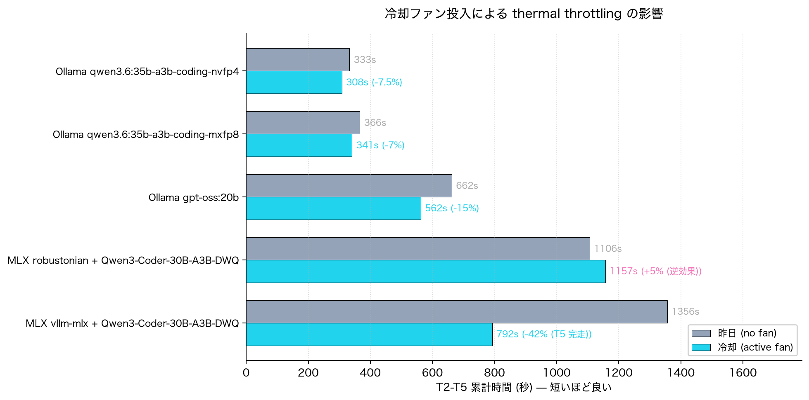

# 詳細データ・失敗モード・運用 Tips

[← Home に戻る](./){: .btn .btn-outline }

---

## 統合サマリー (M5 Max 128GB, T2-T5 累計)


> 図: T2-T5 累計時間 (秒) を横軸、モデルを縦軸に並べた横棒グラフ。
> 青 = Anthropic クラウド / 緑 = Ollama / オレンジ = MLX (vllm-mlx) / 紫 = ds4 (DeepSeek V4 Flash) / 赤の斜線 = 見せかけ数字 (artifact 不足 or OOM)。
> 青の破線が Opus 4.8 ベースライン (106s)。上位 6 モデルが 106〜121s の同じ団子。

### 完全ランキング (成功のみ、累計昇順)

| # | Backend | モデル | 累計 | T2 | T3 | T4 | T5 |
|---|---|---|---|---|---|---|---|
| 🥇 | cloud | **Opus 4.8** | **106s** | 18 | 19 | 47 | 22 |
| 2 | Ollama | **qwen3.6:35b-a3b-coding-nvfp4** ⭐ | **111s** | 20 | 45 | 24 | 22 |
| 3 | cloud | Sonnet 5 | 112s | 12 | 16 | 70 | 14 |
| 4 | cloud | Fable 5 | 116s | 27 | 23 | 43 | 23 |
| 5 | Ollama | **qwen3-coder-next:q4_K_M** ⭐ (80B-A3B) | **117s** | 16 | 21 | 56 | 24 |
| 6 | MLX | **unsloth/Qwen3.6-35B-A3B-UD-MLX-4bit** ⭐ | **121s** | 28 | 22 | 37 | 34 |
| 7 | Ollama | qwen3.6:35b-a3b-coding-mxfp8 | 134s | 17 | 46 | 48 | 23 |
| 8 | Ollama | **gpt-oss:120b** (M4 Pro=全 TIMEOUT) | 199s | 24 | 36 | 86 | 53 |
| 9 | Ollama | gpt-oss:20b | 216s | 26 | 84 | 44 | 62 |
| 10 | Ollama | gemma4:26b-mxfp8 (a4b MoE, 26B/3.8B active) | 257s | 25 | 25 | 153 | 54 |
| 11 | ds4 | **DeepSeek V4 Flash q2** (~284B/13B active) ⭐ | **284s** | 55 | 42 | 121 | 66 |
| 12 | MLX | Qwen3-Coder-30B-A3B-Instruct-4bit-DWQ | 451s | 24 | 42 | 346 | 39 |
| 13 | Ollama | qwen3.6:27b-coding-mxfp8 (dense, M4 Pro=DNF) | 830s | 119 | 120 | 389 | 202 |
| 14 | Ollama | gemma4:31b-coding-mtp-bf16 (coding + MTP) | 897s | 147 | 144 | 439 | 167 |

⭐ = 各ティア (Ollama / MLX / ds4) の推奨。cloud は Opus 4.8 が僅かに最速。

### Local vs Cloud の速度比 (Opus 4.8 = 1.00x)

| ベース | 累計 | Opus 4.8 比 |
|---|---|---|
| Opus 4.8 (cloud) | 106s | 1.00x |
| **Ollama nvfp4 (ローカル最良)** | **111s** | **1.05x** (5% 遅) |
| Sonnet 5 (cloud) | 112s | 1.06x |
| Fable 5 (cloud) | 116s | 1.09x |
| Ollama qwen3-coder-next:q4_K_M | 117s | 1.10x |
| MLX Qwen3.6-UD-4bit (MLX 最良) | 121s | 1.14x |
| ds4 DeepSeek V4 Flash | 284s | 2.68x |
| ds4 は frontier 級モデル (284B) を local で動かす対価と考えると 2.7x は破格 |

---

## 失敗モード (今回の M5 Max round で観測)

### `batiai/minimax-m2.7:q3` — 128GB でも「上限モデル」

- ollama pull は成功、モデル 87GB
- 起動時にロードすると **122GB VRAM (1%/99% CPU/GPU split, CPU 側オフロード発生)**
- Claude Code から呼ぶと `API Error: 500 llama-server chat error: Compute error` を吐いて 4/4 タスク FAIL
- 累計 719s (各タスク ~180s の空回り、artifact 0/4)
- 128GB unified でも `88GB モデル + 25K トークン初期プロンプト + KV cache` が入り切らない
- **教訓: M4 Pro 64GB での gpt-oss:120b 全 TIMEOUT と同じ「上限モデル」現象は、上限の位置が変わるだけで消えない**

### `devstral-small-2` — 「やる気だけ」の世代交代

- Mistral の 2025-12 refresh、Devstral 系。M4 Pro 時代の `devstral:24b` も同種の失敗をした
- T2: `<function=Read>` を宣言だけして手を動かさず 23s で idle → FAIL
- T3: 同じく 22s で idle → FAIL
- T4: 23s で終了 (T4 は verify SKIP なので合否は付かないが挙動は T2/T3 と同種の空走臭い)
- T5: 40s で `wc_tool.py` を作った → PASS
- **verify 対象 3 タスク中 1/3 発火の非決定的挙動**。「agentic 用途を謳っている」だけでは Claude Code 相性の保証にならない
- 累計 108s と見せかけは速いが `ls` すれば T2/T3 の FAIL が見える

### `qwen3.6:35b-a3b-coding-nvfp4` の T5 で `<ToolSearch>` XML 漏れ (間欠)

- 初回ラン: T5 で `<ToolSearch><query>select:Read,Bash</query></ToolSearch>` を平文出力、tool 発火せず 422s 空回り → FAIL
- 再ラン: T5 = 22s で正常発火 → PASS
- Claude Code v2.1.207 で追加された **deferred tools (ToolSearch)** の tool 表面に対して、モデルが確率的に対応しきれない
- **教訓: 新しい CC バージョンは新しい tool 表面を持ち込み、既存モデルとの相性は再検証が必要**

### `qwen3-coder-next:80b` タグ廃止

- 5 月時点で存在した `:80b` タグは 7 月時点で消失、`Error: pull model manifest: file does not exist`
- 現在は quant 命名 (`:q4_K_M` / `:q8_0` / `:cloud`) に変わっている
- **教訓: community/registry のタグは volatile**、benchmark 継続には runner に「pull 失敗を SKIP して次に進む」ガードが必須

---

## 用途別の推奨

| ユースケース | 推奨 |
|---|---|
| Claude Code をローカルで本気運用 (総合本命) | **Ollama + qwen3.6:35b-a3b-coding-nvfp4** (21GB pull / VRAM ~19.5GB、cloud 比 1.05x) |
| 80B クラスを叩きたい | **Ollama + qwen3-coder-next:q4_K_M** (52GB pull、cloud 比 1.10x) |
| MLX 派 | **vllm-mlx 0.4.0 + unsloth/Qwen3.6-35B-A3B-UD-MLX-4bit** (Ollama nvfp4 と 10s 差 = 揺らぎ範囲) |
| Frontier 級を local で味わう | **ds4 + DeepSeek V4 Flash q2** (~81GB pull、cloud 比 2.68x でも frontier) |
| gpt-oss 系を tool 込みで動かす | **Ollama 一択** (128GB あれば `:120b` も普通に動く、cloud 比 1.88x) |
| Gemma 系を試したい | **gemma4:26b-mxfp8** (a4b MoE、cloud 比 2.42x)。`31b-coding-mtp-bf16` は MTP でも T4 が 439s と重く 897s、Qwen 系に届かない |
| 避けるべき | `batiai/minimax-m2.7:q3` (128GB でも OOM) / `devstral-small-2` (やる気だけ) / dense 27B (830s は cloud 比 7.8x で実用外) |

---

## クイックスタート

### Ollama 版 (一番楽)

```bash
# 1. モデル取得 (推奨: nvfp4 または qwen3-coder-next:q4_K_M)
ollama pull qwen3.6:35b-a3b-coding-nvfp4

# 2. Claude Code を Ollama に向ける (環境変数 3 つだけ)
export ANTHROPIC_AUTH_TOKEN=ollama
export ANTHROPIC_API_KEY=""
export ANTHROPIC_BASE_URL=http://localhost:11434

claude --model qwen3.6:35b-a3b-coding-nvfp4 --permission-mode bypassPermissions
```

Claude Code は履歴が太くなりやすいので、`OLLAMA_CONTEXT_LENGTH=131072` (128K) 以上を推奨:

```bash
launchctl setenv OLLAMA_CONTEXT_LENGTH 131072    # macOS App 版
# または `ollama serve` 実行時に env で
```

### MLX 版 (vllm-mlx 0.4.0)

```bash
# 1. vllm-mlx 導入 (M4 Pro 時代 0.2.9 の tool 壊れ問題は 0.4.0 で解消)
uv tool install vllm-mlx

# 2. サーバ起動 (tool パーサ自動判定の wrapper を同梱)
./mlx/scripts/start_server.sh unsloth/Qwen3.6-35B-A3B-UD-MLX-4bit 8000

# 3. 別シェルで Claude Code を MLX に向ける
./mlx/scripts/local_claude.sh unsloth/Qwen3.6-35B-A3B-UD-MLX-4bit 8000
```

### ds4 版 (DeepSeek V4 Flash / DwarfStar)

antirez の Metal 専用 DeepSeek V4 エンジン。**Metal は primary target で、M5 Max 128GB は README に明示 benchmark 行がある**構成。

```bash
# 1. clone + Metal build (macOS)
git clone https://github.com/antirez/ds4.git
cd ds4
make                             # → ds4 / ds4-server / ds4-bench / ds4-agent

# 2. モデル取得 (81GB, 128GB 機なら q2-imatrix)
./download_model.sh q2-imatrix   # → gguf/DeepSeek-V4-Flash-*-imatrix.gguf + ds4flash.gguf symlink

# 3. サーバ起動 (Anthropic 互換 :8000)
./ds4-server --chdir "$PWD" --ctx 100000 \
    --kv-disk-dir /tmp/ds4-kv --kv-disk-space-mb 8192

# 4. 別シェルで Claude Code を ds4 に向ける (README の claude-ds4 wrapper 相当)
unset ANTHROPIC_API_KEY
export ANTHROPIC_BASE_URL=http://127.0.0.1:8000
export ANTHROPIC_AUTH_TOKEN=dsv4-local
export ANTHROPIC_MODEL=deepseek-v4-flash
export CLAUDE_STREAM_IDLE_TIMEOUT_MS=600000
claude --model deepseek-v4-flash --permission-mode bypassPermissions
```

初回ロードは 82.7GiB を mmap するので ~8 秒 + warmup ~7ms、server ready まで ~20 秒。以降のセッションは KV disk cache で prefix reuse が効く。

---

## 共通エイリアス (~/.zshrc 用)

```bash
local-claude() {
  export ANTHROPIC_AUTH_TOKEN=ollama
  export ANTHROPIC_API_KEY=""
  export ANTHROPIC_BASE_URL=http://localhost:11434
  claude --model "${1:-qwen3.6:35b-a3b-coding-nvfp4}" \
         --permission-mode bypassPermissions "${@:2}"
}
```

`local-claude` で本命 (nvfp4) 起動、`local-claude qwen3-coder-next:q4_K_M` で 80B に切替、`local-claude gpt-oss:120b` で 120B 級に切替、と使い分け。

### モデル切替時の GPU メモリ即時解放 (Ollama)

```bash
curl -s -X POST http://localhost:11434/api/generate \
  -d '{"model":"qwen3.6:35b-a3b-coding-nvfp4","keep_alive":0}'
```

---

## クラウド版 (Fable 5 / Opus 4.8 / Sonnet 5) の詳細

同一 T2-T5・同一マシン (MacBook Pro M5 Max)・同一 `claude --print` パスで Anthropic クラウドを計測。ローカル計測との唯一の差は `ANTHROPIC_BASE_URL / AUTH_TOKEN / API_KEY` の unset (Claude Max 標準認証で cloud に出る)。

### タスク別タイミング

| タスク | Fable 5 | Opus 4.8 | Sonnet 5 |
|---|---|---|---|
| T2 バグ修正 | 27s | 18s | **12s** |
| T3 マルチファイル package | 23s | 19s | 16s |
| T4 リファクタ | 43s | 47s | 70s |
| T5 CLI + エラーハンドリング | 23s | 22s | 14s |
| **累計** | **116s** | **106s** | **112s** |
| 全 artifact 検証 | ✅ | ✅ | ✅ |

### 観察

- **Opus 4.8 が最速** (106s)、続いて Sonnet 5 (112s)、Fable 5 (116s)。T2/T3/T5 の短い応答系では Sonnet 5 が Opus を上回るが、T4 の思考系タスクで Sonnet 5 が 70s と大きく食い、累計では Opus 4.8 が勝つ
- **やる気だけ現象は当然ゼロ**。tool_use を確実に発火、artifact が決定論的に作られる (これは cloud の商用モデルとしてのベースライン品質)
- M4 Pro 時代の Sonnet 4.6 = 80s / Opus 4.7 = 90s と比較すると **クラウド側は 25〜30% "遅く" なっている**。5 系モデルが思考モード寄りにチューニングされた影響と思われる。ローカル最良との差が縮まった要因は「ローカルが速くなった」だけでなく「cloud も慎重になった」の合わせ技

### 再現方法

```bash
mkdir -p ~/tmp/cc-reference-bench/{tests,scripts,results}
cp mlx/tests/run_practical.sh        ~/tmp/cc-reference-bench/tests/  # または run_cloud.sh を使う
cp mlx/scripts/reset_fixtures.sh     ~/tmp/cc-reference-bench/scripts/
~/tmp/cc-reference-bench/scripts/reset_fixtures.sh

# ANTHROPIC_* を unset して cloud に出る
unset ANTHROPIC_BASE_URL ANTHROPIC_AUTH_TOKEN ANTHROPIC_API_KEY
claude --print --model claude-opus-4-8 --permission-mode bypassPermissions "<prompt>"
```

`run_cloud.sh` を Repo 側で提供 (Fable 5 / Opus 4.8 / Sonnet 5 を 1 コマンドで回す)。

---

## 検証で得た 6 つの教訓

**M4 Pro 時代から継続 (今も有効):**

1. **Ollama 0.22.1+ (現行 0.31.2) は Anthropic Messages API ネイティブ互換**。プロキシ不要、環境変数 3 つで Claude Code 直結。
2. **Tool 互換性は「モデル単体」では決まらない**。サーバ × モデル × 量子化フォーマット × parser 実装 × **Claude Code バージョン** の 5 つ組すべてに依存する。今回は Claude Code 2.1.207 が追加した `<ToolSearch>` 表面で既存モデルの間欠発火不全が観測された (nvfp4 T5)。
3. **「やる気だけモデル」は最も危険な失敗モード**。M5 Max 世代でも `devstral-small-2` で再現。「新しくて評判が良い」だけでは信じられない。**`ls` で artifact を必ず確認**。
4. **1 ran 計測は順位を決められない**。T4 で verbose loop、T5 で XML 漏れなど、確率的に爆発するタスクがある。重要な選択 (推奨モデル切替) は最低 3 ran。

**M5 Max 128GB 世代で追加された 2 つ:**

5. **「上限モデル」は 128GB でも消えない、上限の位置が変わるだけ**。M4 Pro での gpt-oss:120b (全 TIMEOUT) が M5 Max では 199s で完走した一方、`batiai/minimax-m2.7:q3` (88GB) が 128GB でロード時 122GB を要求して同じパターンで全 4/4 fail。**モデルサイズと利用可能 RAM の余裕を見た「上限手前」判断は継続して必要**。
6. **Community/registry のタグは volatile**。`qwen3-coder-next:80b` は 2 ヶ月で消失、quant 命名 (`:q4_K_M` 等) に変更された。benchmark 継続には runner に「pull 失敗 → SKIP して次モデル」ガードが必須。

---

## M4 Pro / 64GB 世代 (参考, 2026-05)

このリポジトリは 2026-05 に Mac mini M4 Pro / 64GB で始まりました。M4 Pro のデータは新しい M5 Max データで書き換えず、以下に参考として保持しています (CLAUDE.md: 「ハード世代が変わったら別測定、旧測定は保持」ルール)。

### M4 Pro (Mac mini) 環境

- Mac mini M4 Pro / 14 cores (10P+4E) / 64GB unified / macOS 25.4 系
- Claude Code v2.1.126 / Ollama 0.22.1 / vllm-mlx 0.2.9 / robustonian-mlx-lm (mlx 0.30.6)

### M4 Pro ローカル最良ラインナップ (T2-T5 累計)

| Backend | モデル | 累計 | 備考 |
|---|---|---|---|
| Ollama | qwen3.6:35b-a3b-coding-nvfp4 | 333s | M4 Pro ローカル最良 |
| Ollama | qwen3.6:35b-a3b-coding-mxfp8 | 366s | nvfp4 +10%、VRAM +79% |
| MLX (vllm-mlx 0.2.9) | unsloth/Qwen3.6-35B-A3B-UD-MLX-4bit | 585s | MLX 最良 |
| Ollama | gpt-oss:20b | 662s | 軽量安定機 |
| MLX (robustonian) | Qwen3-Coder-30B-A3B-DWQ | 1106s | fork 経由でのみ動作 |
| Ollama | **qwen3-coder-next:latest (80B-A3B)** | 1295s | (2 ヶ月で `:80b` タグ廃止 → M5 Max では `:q4_K_M` 117s) |
| MLX (vllm-mlx 0.2.9) | Qwen3-Coder-30B-A3B-DWQ | 1356s (T5 timeout) | vllm-mlx 0.2.9 の verbose loop |
| Ollama | gpt-oss:120b | **全 TIMEOUT (2401s)** | 64GB では memory 圧迫 (M5 Max 199s で復活) |

### M4 Pro 時代の失敗ラインナップ (参考)

| モデル | 症状 |
|---|---|
| Ollama qwen3:30b-instruct | やる気だけ (185s, artifact 0/4) |
| MLX gpt-oss-20b-MXFP4-Q4 / Q8 | harmony parser 不全で空走 (270s, artifact 0/4) |
| Ollama gemma4:12b (mxfp8 / mlx / e4b) | MLX prefill 240 tok/s + 生成暴走、T2 単体で 300s+ |
| Ollama devstral:24b | やる気だけ (669s, artifact 0/4) |
| Ollama granite4:latest | 1/4 のみ成功 (609s) |
| Ollama codestral:latest | Ollama レジストリで tool 非対応マーキング、即 EXIT_1 |

### M4 Pro 世代の M5 Max 比

| モデル | M4 Pro | M5 Max | 短縮率 |
|---|---|---|---|
| qwen3.6:35b-a3b-coding-nvfp4 | 333s | 111s | **-67%** |
| qwen3.6:35b-a3b-coding-mxfp8 | 366s (冷却込 341s) | 134s | -61% |
| MLX Qwen3.6-UD-4bit | 585s | 121s | **-79%** |
| Ollama gpt-oss:20b | 662s (冷却込 562s) | 216s | -67% |
| MLX Qwen3-Coder-30B-DWQ | 1356s (T5 timeout) | 451s | -67% + T5 完走 |
| Ollama qwen3-coder-next (80B-A3B) | 1295s | 117s | **-91%** |
| Ollama gpt-oss:120b | 全 TIMEOUT | 199s | (M5 Max 解禁) |
| Ollama qwen3.6:27b-coding-mxfp8 (dense) | DNF | 830s | (M5 Max 解禁) |

**平均 -60〜80% 短縮**。上限モデル (120b, dense 27B) が「走らない → 走る」に転じたケースを除いても、既存モデルは 3 倍前後の高速化。

---

## 冷却ファン投入で thermal throttling を抑えるとどうなる？ (M4 Pro 時代の検証)

M4 Pro 検証時、GPU が 92-95°C に張り付いていたので Mac mini M4 Pro を縦置きにして上に USB クーラーを載せて active cooling を効かせて再走行した結果:



| 構成 | ファンなし | 冷却 | delta |
|---|---|---|---|
| Ollama nvfp4 | 333s | 308s | -7.5% |
| Ollama mxfp8 | 366s | 341s | -7% |
| Ollama gpt-oss:20b | 662s | **562s** | **-15%** |
| MLX vllm-mlx + Qwen3-Coder-30B-DWQ | 1356s (T5 失敗) | **792s** (全完走) | **-42%** |
| MLX robustonian + Qwen3-Coder-30B-DWQ | 1106s | 1157s | +5% (逆効果、VRAM 肥大化) |

Mac mini M4 Pro に対しては強くおすすめだった。MacBook Pro (M5 Max) では筐体設計が異なり、同じ縦置き + 上載せ USB クーラーは物理的にフィットしにくい (試していない)。M5 Max 上での cooling 検証は future work。

---

## リポジトリ上の主要ファイル (GitHub 直リンク)

| 種類 | パス |
|---|---|
| M5 Max 統合 runner (引数でモデル指定) | [ollama/run_all_practical.sh](https://github.com/j3tm0t0/local-llm-macmini/blob/main/ollama/run_all_practical.sh) の M5 Max 適応版 |
| Ollama tmux 駆動 runner | [ollama/tests/run_practical.sh](https://github.com/j3tm0t0/local-llm-macmini/blob/main/ollama/tests/run_practical.sh) |
| MLX サーバ起動 (parser 自動判定) | [mlx/scripts/start_server.sh](https://github.com/j3tm0t0/local-llm-macmini/blob/main/mlx/scripts/start_server.sh) |
| MLX 1 モデル完走 pipeline | [mlx/scripts/run_one_model.sh](https://github.com/j3tm0t0/local-llm-macmini/blob/main/mlx/scripts/run_one_model.sh) |
| MLX Anthropic 互換スモーク | [mlx/scripts/check_anthropic_compat.sh](https://github.com/j3tm0t0/local-llm-macmini/blob/main/mlx/scripts/check_anthropic_compat.sh) |
| Fixture リセット | [mlx/scripts/reset_fixtures.sh](https://github.com/j3tm0t0/local-llm-macmini/blob/main/mlx/scripts/reset_fixtures.sh) |
| 共通プロンプト集 | [tests/practical_prompts.md](https://github.com/j3tm0t0/local-llm-macmini/blob/main/mlx/tests/practical_prompts.md) |
| クラウド版 raw ログ (M4 Pro 時代) | [reference/results/](https://github.com/j3tm0t0/local-llm-macmini/tree/main/reference/results) |
| 比較チャート生成 | [scripts/generate_chart.py](https://github.com/j3tm0t0/local-llm-macmini/blob/main/scripts/generate_chart.py) |

---

## 参考リンク

- Ollama Anthropic 互換: <https://ollama.com/blog/anthropic-api>
- vllm-mlx: <https://github.com/waybarrios/vllm-mlx>
- **ds4 (DwarfStar / DeepSeek V4 Metal engine, by antirez)**: <https://github.com/antirez/ds4>
- antirez "A few words on DS4": <https://antirez.com/news/165>
- robustonian/mlx-lm Anthropic 互換フォーク: <https://github.com/robustonian/mlx-lm/tree/feature/anthropic-compat-api>
- claude-code-local (MLX 駆動 Anthropic API サーバ): <https://github.com/nicedreamzapp/claude-code-local>
- LM Studio Anthropic 互換: <https://lmstudio.ai/docs/developer/anthropic-compat>

---

[← Home に戻る](./){: .btn .btn-outline }
