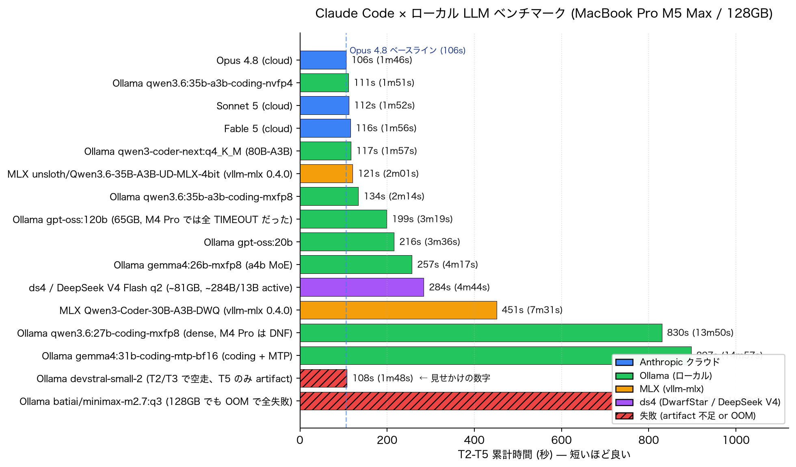

# Claude Code、ローカル LLM でどこまで戦える？
{: .fs-9 }

MacBook Pro **M5 Max / 128GB** で Ollama / MLX / ds4 (DeepSeek V4 Flash) / Anthropic クラウドを T2-T5 同条件で徹底再計測。 
**結論: ローカル最良 (111s) は Opus 4.8 (106s) と 5% 差。もう「クラウドに追いつけない」時代ではない。**
{: .fs-5 .fw-300 }

---

## やったこと

MacBook Pro M5 Max (M5 Max / **128GB** / macOS 26.5.2) に **Claude Code v2.1.207** を入れて、Anthropic クラウドではなくローカル LLM 経由で動かした場合の速度・成功率を横断計測。バックエンドは 4 系統:

- **Ollama** (0.31.2, Anthropic Messages API ネイティブ互換)
- **MLX** (vllm-mlx 0.4.0)
- **ds4 / DwarfStar** (antirez の DeepSeek V4 Flash 専用 Metal エンジン)
- **Anthropic クラウド** (Fable 5 / Opus 4.8 / Sonnet 5)

**参考: M4 Pro / 64GB 世代のデータは [details.md の「M4 Pro 参考」セクション](details.md#m4-pro--64gb-世代-参考-2026-05) にそのまま残してあります**。今回の M5 Max は別のハード + 別のモデル世代 + 別の Claude Code バージョンなので、書き換えではなく「もう 1 つのスナップショット」として並置しています。

タスクは前回と同一の T2-T5、fixture も同一:

- **T2** バグ修正 (`factorial(0)` → `1` に直して実行)
- **T3** マルチファイル package 作成 (`calc/__init__.py` + `calc/ops.py` + `test_calc.py`)
- **T4** リファクタ (3 関数の重複除去 + 動作同一性確認)
- **T5** CLI ツール作成 (`wc_tool.py` + 存在しないファイルへのエラーハンドリング)

14 構成 (cloud 3 + Ollama 8 + MLX 2 + ds4 1) を同じセッションで走らせ、累計時間と `ls` による artifact 検証結果を並べました。

---

## 3 つの発見

### 1. cloud と local の団子ができた

M5 Max ローカル最良の **Ollama qwen3.6:35b-a3b-coding-nvfp4 (111s)** と、クラウド最良の **Opus 4.8 (106s)** の差は **5%**。ここに Sonnet 5 (112s) / Fable 5 (116s) / qwen3-coder-next:q4_K_M (117s) / MLX Qwen3.6-UD-4bit (121s) が挟まって、上位 6 モデルが **106〜121s の同じ団子**に収まった。

M4 Pro 世代では cloud 80s に対しローカル最良が 333s (4.2x 遅い)、「速度で cloud に勝てる場面は無い」と書いていた。1 年経たずして、この結論は事実上ひっくり返った。要因は 3 つ同時に効いた: (a) M4 Pro → M5 Max のハード進化、(b) qwen3-coder-next / Qwen3.6-coding fine-tune 系の登場、(c) Claude Code 側の cache / tool 発火経路の熟成。

### 2. 128GB は「単に載せられる」だけでなく「速く動く」ことを意味した

M4 Pro (64GB) では **`gpt-oss:120b` が全 4 タスクで TIMEOUT**、**dense `qwen3.6:27b-coding-mxfp8` が DNF** だった 2 つの構成が、M5 Max ではそれぞれ **199s / 830s で全 PASS** に転じた。特に gpt-oss:120b は cloud Opus 4.8 の 1.9x で普通に使える範囲。

さらに 128GB でしか成立しないバックエンドとして **[antirez の ds4](https://github.com/antirez/ds4)** で **DeepSeek V4 Flash (~284B total / ~13B active) を q2 quant で 284s** で完走できた。frontier 級のモデルが Mac 1 台のローカルで、cloud Opus の 2.7x で動く。1 年前には Mac ローカルで走らせる選択肢すら存在しなかったモデルクラス。

### 3. 新しい失敗モードも解禁された

- **`batiai/minimax-m2.7:q3` (~88GB)** は 128GB 積んでもロード時 VRAM 122GB で残 6GB、ollama backend の llama-server が生成中に `500 Compute error` を吐いて 4/4 タスク FAIL。**「上限モデル」現象は 128GB でもまだ存在する**。
- **`devstral-small-2`** は Mistral が "agentic 目的" と謳ったが、Claude Code 経由では T2/T3 で `<function=Read>` などを宣言だけして手を動かさない — **やる気だけ現象** が世代交代しても継承された。「新しくて評判が良い」だけでは信じられない、`ls` で artifact 検証は今後も必須。
- **`qwen3.6:35b-a3b-coding-nvfp4` の T5** は初回で `<ToolSearch>` XML を垂れ流して 422s 空回り、再ランでは 22s で正常発火。**間欠発生する tool-format 漏れ**は M4 Pro 時代 (T4 verbose loop 揺らぎ) と同じで、1 ran 計測は依然として順位付けの材料にはならない。

---

## ⚠️ 重要な前提: Macs Fan Control で fans MAX ピン留め必須

上の数字は **すべて MacBook Pro の内蔵ファンを Macs Fan Control で 100% RPM に固定した状態**での実測。**デフォルトの auto RPM (静音優先) のままだと sustained LLM 負荷を捌ききれず、同じモデルの累計時間が 20-45 倍に膨張する** ことを別途検証した。

| モデル | fan-auto (デフォルト) | fan MAX |
|---|---|---|
| Ollama nvfp4 | **4054s** (T4 TIMEOUT) | **140s** |
| MLX Qwen3-Coder-DWQ | **2381s** (T4 verbose) | **142s** |

thermal_pressure を並行実測すると fan-auto では Heavy 6-25% (throttling あり)、fan MAX では Nominal 100% (throttling ゼロ)。ラップトップは静音チューニングと sustained AI 負荷が両立しないので、常用するなら Macs Fan Control 必須。詳細は [詳細ページの Macs Fan Control セクション](details.md#macbook-pro-m5-max-macs-fan-control-で-fans-max-にしないと本気の性能出ない)。

---

## 結論

M4 Pro 時代の結論「クラウド版を使うのが合理的、ローカルは Anthropic 落ちた時の避難先」から、M5 Max 世代では **「クラウドとローカルは互角、選択理由はコスト構造とプライバシー」** に軸が移った。

日常的なコーディング agent 用途で 5% 差なら、月額 API 費用の見合い / オフライン要件 / 機密データ 取扱いのどれか 1 つがあれば十分にローカル運用は正当化できる。Anthropic 障害時の保険という消極的位置付けから、**通常運用の第一候補にも入り得る** レベルまで来た。

一方で、失敗モードは 128GB 世代でも消えていない (`minimax`, `devstral-small-2`, `nvfp4` の間欠 XML 漏れ)。「動く」と「安定して動く」の間はまだ埋まっていないので、`ls` による artifact 検証と、重要な選択は 3 ran 揺らぎ確認、という前世代からの教訓はそのまま生きている。

---

## もっと詳しく

- 📊 [**詳細データ・全ランキング・失敗モード・運用 Tips**](details.md) — 14 構成の完全比較表、ds4 / vllm-mlx セットアップ、クラウド 3 モデルのタスク別タイミング、M4 Pro との対比表、M4 Pro 世代の参考データ、4 つの教訓 + M5 Max 世代で追加された 2 つの教訓
- 🔧 [**GitHub リポジトリ**](https://github.com/j3tm0t0/local-llm-macmini) — スクリプト (`run_m5max.sh` / `run_ds4_bench.sh` / `run_mlx_bench.sh` / `run_cloud.sh`)、テスト fixture、計測ログ、チャート生成コード

---

[Source on GitHub](https://github.com/j3tm0t0/local-llm-macmini){: .btn .btn-outline }
